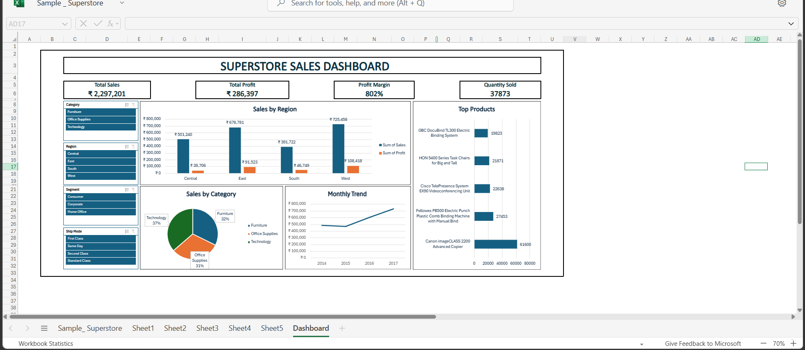

# 📊 Superstore Sales Analysis

This project analyzes the **Sample Superstore dataset** to uncover insights about sales, profit, and regional performance using **Microsoft Excel**.

---

## 🧠 Objective
To perform data cleaning, create KPIs, and design an interactive Excel dashboard that highlights business performance metrics.

---

## 🛠 Tools Used
- Microsoft Excel  
  - Pivot Tables  
  - Charts and Slicers  
  - KPI Cards  
  - Conditional Formatting  

---

## 📂 Files in this Repository
| File Name | Description |
|------------|-------------|
| `Sample_Superstore.xlsx` | Dataset used for the dashboard |
| `Superstore_Sales_Analysis_Portfolio.pdf` | Visual project report with insights and dashboard screenshots |
| `Rakesh_Dabbikar_Data_Analyst_Resume.pdf` | ATS-friendly professional resume |
| `README.md` | Project overview and details |

---

## 📈 Key Metrics
| KPI | Description | Example Value |
|-----|--------------|----------------|
| **Total Sales** | Overall revenue generated | ₹22,97,201 |
| **Total Profit** | Net profit earned | ₹2,86,397 |
| **Profit Margin** | Profit ratio vs. sales | 10% |
| **Quantity Sold** | Total number of items sold | 37,873 |

---

## 📊 Dashboard Preview

---

## 📊 Dashboard Insights
- ✅ **West Region** generated the highest sales and profit.  
- ✅ **Technology Category** contributed the most profit (37%).  
- ✅ **Canon Printers** ranked among the top-selling products.  
- ✅ **November–December** recorded the peak sales months.  

---

## 🧩 Project Learnings
This project helped me practice:
- Data cleaning and preparation in Excel  
- Building KPIs and pivot-based dashboards  
- Identifying actionable business insights  

---

## 👨‍💻 About the Author
**Rakesh Dabbikar**  
Aspiring Data Analyst skilled in Excel, Power BI, and SQL.  
📧 rakeshdabbikar@gmail.com  
🌐 [LinkedIn Profile](https://www.linkedin.com/in/rakeshdabbikar)

---

⭐ **If you found this project helpful, consider giving it a star on GitHub!**
